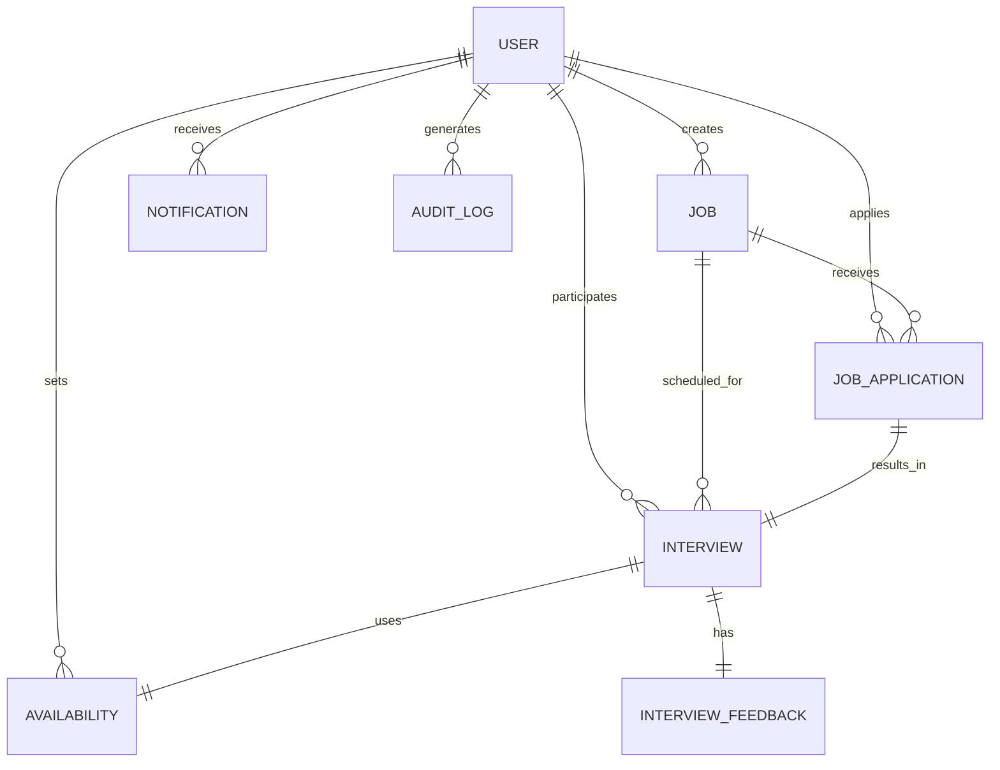

# Smart Interview Scheduler 🚀

An Enterprise-grade Interview Scheduling and Candidate Management System built with Java and Spring Boot.

## 🥇 Why this project is "Elite"?
- **Strict RBAC**: Secure path-based authorization for Admin, HR, Interviewer, and Candidate.
- **Smart Scheduling Engine**: Greedy algorithm with conflict detection and interviewer workload balancing.
- **Production-Ready**: SLF4J logging, Global Exception Handling, and Core Logic Unit Testing.
- **Full-Featured**: PDF reports, In-app notifications, Email alerts, and Audit logs.

---

## 🧠 Smart Scheduling Engine
The heart of this project is the scheduling logic. It ensures that no two interviews overlap for a candidate, even if different interviewers are involved.

### Conflict Detection Logic
We use a robust overlapping check:
```java
if (newStart < existingEnd && newEnd > existingStart) {
    // Conflict detected!
}
```
### How it works:
1. **Exact-Slot Mode**: HR chooses a specific time. The engine verifies if the interviewer is free and the candidate has no other interviews at that time.
2. **Auto-Assign Mode**: The engine picks the next available slot for the interviewer.
3. **Workload Balancing**: If an interviewer is busy (e.g., >3 active interviews), the engine automatically suggests less busy interviewers to prevent burnout.

---

## 📊 Database Design (ER Diagram)



---

## 🛠 Tech Stack
- **Backend**: Java 17, Spring Boot 3.2.5, Spring Security
- **Data**: Spring Data JPA, H2 (Dev) / MySQL (Prod)
- **Frontend**: Thymeleaf, Vanilla CSS, JS
- **Tools**: iText (PDF Reports), Maven

---

## 🚀 Setup & Installation
1. **Clone the repository**
2. **Configure Database**: By default, it uses H2. Update `application.properties` for MySQL if needed.
3. **Build the project**:
   ```bash
   mvn clean install
   ```
4. **Run the App**:
   ```bash
   mvn spring-boot:run
   ```
5. **Run Tests**:
   ```bash
   mvn test
   ```

---

## 🧪 Testing Core Logic
The project includes unit tests for the core service layers to ensure scheduling reliability.
- `InterviewServiceTest`: Verifies conflict detection and success scenarios.
- `UserServiceTest`: Ensures secure registration and duplicate email prevention.

---

## 🔐 Authorization Roles
- `/admin/**` -> System administration and user management.
- `/hr/**`    -> Job posting, shortlisting, and scheduling.
- `/interviewer/**` -> Managing availability and submitting feedback.
- `/candidate/**`   -> Browsing jobs and tracking application status.
